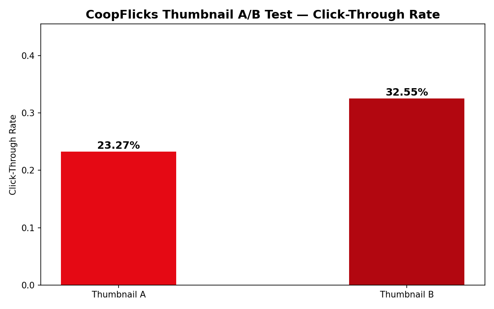
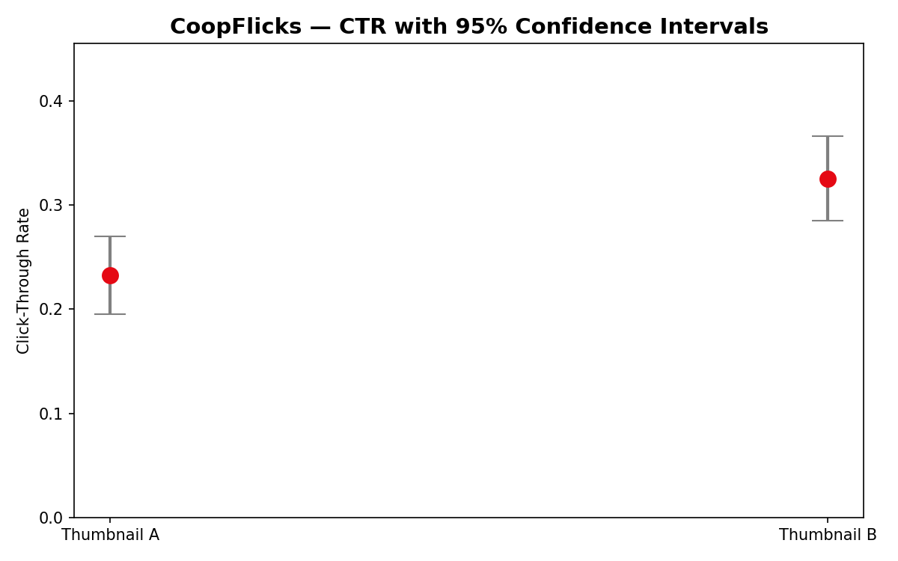

# 🎬 CoopFlicks Thumbnail A/B Testing Dashboard

Ever wonder how Netflix decides which thumbnail to show you? That's exactly what this project is all about. CoopFlicks is a fun parody project that simulates a real-world A/B test to figure out which thumbnail gets more clicks — built with Python and Streamlit.

---

## 📊 What is this project?

Streaming platforms like Netflix are constantly running experiments to see which thumbnail artwork gets the most clicks from users. This project simulates that exact process — two thumbnail variants (A and B) are shown to randomly assigned users, and we use statistics to figure out which one wins.

Here's everything the project covers:
- Designing and simulating a real A/B test experiment
- Generating a realistic fake dataset of 1,000 users
- Running statistical significance testing using the chi-square method
- Visualizing results with confidence intervals and CTR comparisons
- Wrapping it all up in a fun interactive Streamlit dashboard

---

## 🛠️ Built With

- **Python** — core programming language
- **pandas** — data manipulation
- **NumPy** — random data generation
- **SciPy** — statistical testing (chi-square, confidence intervals)
- **Matplotlib** — data visualization
- **Streamlit** — interactive dashboard

---

## 🚀 How to Run It

### 1. Clone the repo
```bash
git clone https://github.com/coopernicklaus/CoopFlicks-Thumbnail-A-B-Testing.git
cd CoopFlicks-Thumbnail-A-B-Testing
```

### 2. Install the dependencies
```bash
pip install pandas scipy matplotlib seaborn streamlit
```

### 3. Generate the dataset
```bash
python generate_data.py
```

### 4. Run the statistical analysis
```bash
python analysis.py
```

### 5. Fire up the dashboard 🎬
```bash
streamlit run dashboard.py
```

Your browser will automatically open the dashboard at `http://localhost:8501` — enjoy!

---

## 🔬 How It Works

**1. Data Generation (`generate_data.py`)**
We simulate 1,000 CoopFlicks users and randomly assign each one to either Group A (Thumbnail A) or Group B (Thumbnail B). Each user then either clicks or doesn't based on their group's click-through rate. All of this gets saved to a CSV file.

**2. Statistical Analysis (`analysis.py`)**
We run a chi-square test on the data to figure out whether the difference in click-through rates is real or just random chance. If the p-value comes back below 0.05 we've got a winner! We also calculate 95% confidence intervals for each group to show the range of likely true click-through rates.

**3. Interactive Dashboard (`dashboard.py`)**
The fun part! The Streamlit dashboard lets you drag sliders to change the sample size, click-through rates, and significance threshold — and everything updates live. You'll see the two thumbnails side by side, CTR charts, confidence interval plots, and a winner announcement at the bottom.

---

## 📸 Screenshots

*CTR comparison chart*


*Confidence interval plot*


---

## 📁 Project Structure
```
CoopFlicks-ab-test/
│
├── data/
│   ├── ab_test_results.csv        ← the generated dataset
│   ├── ctr_comparison.png         ← CTR bar chart
│   └── confidence_intervals.png   ← confidence interval plot
│
├── images/
│   ├── thumbnail_a.jpg            ← Thumbnail A
│   └── thumbnail_b.jpg            ← Thumbnail B
│
├── generate_data.py               ← generates fake user data
├── analysis.py                    ← runs the stats
├── dashboard.py                   ← Streamlit dashboard
└── README.md
```

---

## 👤 Author

**Cooper Christensen**  
[GitHub](https://github.com/coopernicklaus)

---

*CoopFlicks — because Netflix can be buns sometimes.* 🍿